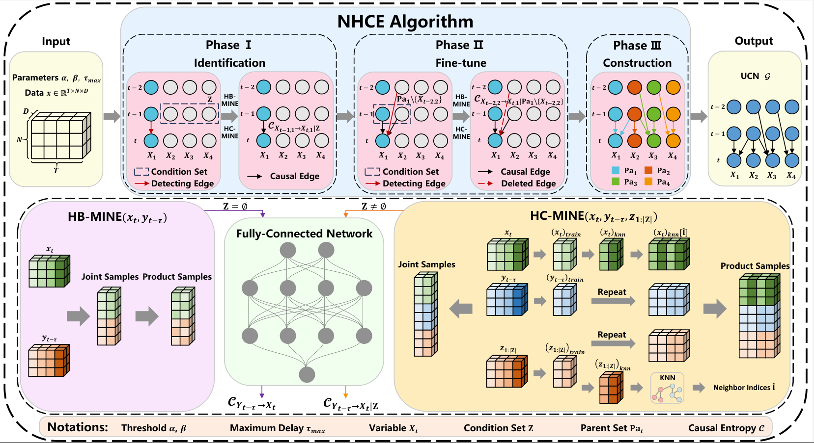

<div align="center">
  <h2><b> NHCE: A Neural High-order Causal Entropy Algorithm for Disentangling Coupling Dynamics </b></h2>
</div>


<div align="center">


**[<a href="https://ieeexplore.ieee.org/abstract/document/10716792">Paper Page</a>]**
</div>

# Updates

🚩 **News** (2024.10): **NHCE** has been accepted by **TNSE**.

## Introduction

🏆 **NHCE (Neural High-order Causal Entropy)** addresses the dimensionality disaster problem in identifying causal relationships within high-order multivariate systems. The NHCE includes two components, HB-MINE and HC-MINE, and its performance is validated through benchmark experiments and collective motion datasets, such as pigeon and dog groups. The results demonstrate that NHCE can deeply analyze the role of complex leadership in coupled dynamics.

- Background 🌐: Collective behavior is a common pattern in social interactions among individuals, and understanding coupled dynamics from a network model perspective is a long-standing and challenging task.

- Problem 🤔: To build an accurate interdependence network, a hierarchical network model is proposed, and information tools are used to quantify the uncertainty of spatio-temporal interactions.

- Methodology 🛠️: The NHCE algorithm is introduced, including HB-MINE and HC-MINE, to tackle the problem of causal relationship identification in high-order multivariate systems.

- Experiments 🧪: The performance of the NHCE algorithm is validated through benchmark experiments and collective motion datasets, showing its application value in revealing causal mechanisms in coupled dynamics.

- Conclusion 🏁: The NHCE algorithm provides a deep analysis of complex leadership in coupled dynamics, which is significant for understanding and solving problems related to coupled dynamics.

## Overall Architecture
**NHCE** algorithm is a three-phase process for constructing a temporal-causal graph, also known as a Spatio-Temporal Bayesian Network (STBN) or Unique Causal Network (UCN). The three phases of the NHCE algorithm are:

- Phase I: Identifying candidate parents for each variable by computing causal entropy using HB-MINE and HC-MINE to determine which nodes/variables to include in the parent set.

- Phase II: Fine-tuning each parent set by traversing all nodes within the set to remove weak causal connections.

- Phase III: Linearly combining all subgraphs from the parent sets into a complete Unique Causal Network (UCN).

<p align="center">

</p>


- HB-MINE (High-dimensional Bi-variate Mutual Information Neural Estimation) estimates the causal entropy between two variables without considering any conditional set.

- HC-MINE (High-dimensional Conditional Mutual Information Neural Estimation) estimates the causal entropy between variables when there is a non-empty conditional set.


## Get Started

1. Install requirements. ```pip install -r requirements.txt```
2. Run the main code. ```python nhce.py```


## Citation
>
> 🙋 Please let us know if you find out a mistake or have any suggestions!
> 
> 🌟 If you find this resource helpful, please consider to star this repository and cite our research:

```bibtex
@article{he2024NHCE,
  author={Yanyan He and Mingyu Kang and Duxin Chen and Wenwu Yu},
  journal={IEEE Transactions on Network Science and Engineering}, 
  title={NHCE: A Neural High-Order Causal Entropy Algorithm for Disentangling Coupling Dynamics}, 
  year={2024},
  volume={11},
  number={6},
  pages={5930-5942},
  doi={10.1109/TNSE.2024.3480710}}
```


## Further Reading
[**Identifying Unique Spatial-Temporal Bayesian Network without Markov Equivalence**](https://ieeexplore.ieee.org/abstract/document/10723109), in *TAI* 2024.

**Authors**: Mingyu Kang and Duxin Chen and Ning Meng and Gang Yan and Wenwu Yu

```bibtex
@article{kang2024identifying,
  author={Mingyu Kang and Duxin Chen and Ning Meng and Gang Yan and Wenwu Yu},
  journal={IEEE Transactions on Artificial Intelligence}, 
  title={Identifying Unique Spatial-Temporal Bayesian Network without Markov Equivalence}, 
  year={2024},
  volume={},
  number={},
  pages={1-10},
  doi={10.1109/TAI.2024.3483188}}
```


## Contact

If you have any questions or want to use the code, feel free to contact:
* Yanyan He (heyy@seu.edu.cn)
* Mingyu Kang (kangmingyu@seu.edu.cn)   
